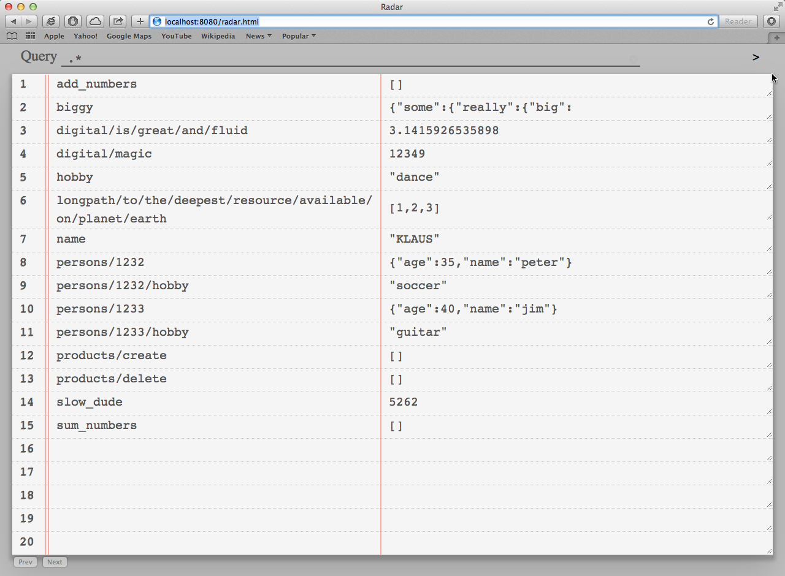
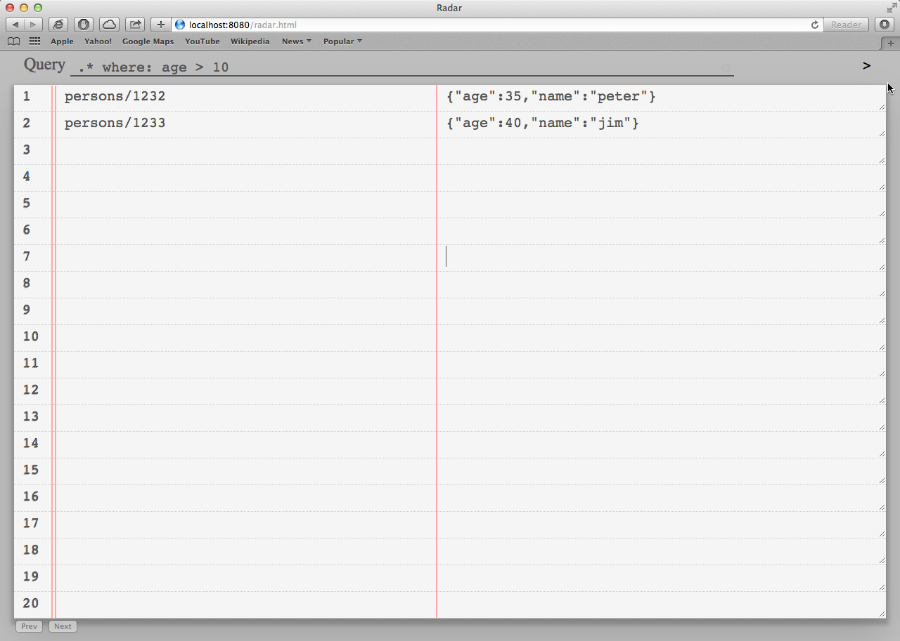

# What is Radar?

A Webinterface for [Jet](http://jetbus.io).

With radar you can:

 *    Query Jet Bus States and Methods by path or (value) filter
 *    Get realtime updates when States and Methods are added or removed
 *    Get realtime updates when States change
 *    Set states to a new value
 *    Call methods

# Install

In general, the radar.html, radar.js, jet.js and radar.css must SOMEHOW be served by your http server.
A jet daemon must also run (what else?).

The [node-jet](http://github.com/lipp/node-jet) daemon has a built in webserver. Just point jetd.js to the radar folder:

    $ sudo npm install node-jet -g 
    $ jetd.js /somepath/radar

The [lua-jet](http://github.com/lipp/lua-jet) daemon has NO built in webserver. You can run simple_webserver.lua which 
requires orbit to be installed:

    $ sudo luarocks install orbit
    $ cd /somepath/radar
    $ ./simple_webserver
    
Both (http) servers listen on port 8080, so this [link](htttp://localhost:8080) should point you to your radar.

# Screenshots

